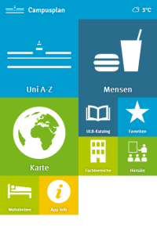

# WWU Campus Plan App 

This is a web app version of a the **Campus Plan App** developed by the [University of Münster](http://www.uni-muenster.de/). The goal of this web app is to subsequently replace the existing native versions for [iOS](http://itunes.apple.com/de/app/wwu-campus-plan/id474030032?mt=8) and [Android](https://play.google.com/store/apps/details?id=ifgi.android) in order to reduce the maintenance effort to one code base.



## Installation

### Requirements

* Apache Webserver
	* mod_rewrite enabled
* NGINX works too, see [configuration example](https://gist.github.com/chk1/d8149378fcea2cf72778)
* PHP 5.x
* bower

### Installation

1. Clone the repository into your webserver htdocs
2. Configure your webserver to redirect requests to `index.html`
2. Run ```bower update``` to install the JS libraries and CSS files
3. Create the directory ```api/cache``` and give your webserver read/write access: ```chmod www-data:www-data api/cache/```

## Attributions

* Map icons `img/awesomemarkers-*.png` derived from the [Awesome Markers](https://github.com/lvoogdt/Leaflet.awesome-markers) project (MIT license)
* Navigation & menu icons from [Iconmonstr](http://iconmonstr.com/) (Creative Commons license) and [The Noun Project](http://thenounproject.com/) (Public Domain)
* [Weather icons](http://erikflowers.github.io/weather-icons/) (`fonts/weathericons*`) by Lukas Bischoff & Erik Flowers (SIL Open Font License 1.1 & MIT License)
* [Signika font](http://www.google.com/fonts/specimen/Signika) by Anna Giedryś (SIL Open Font License 1.1)